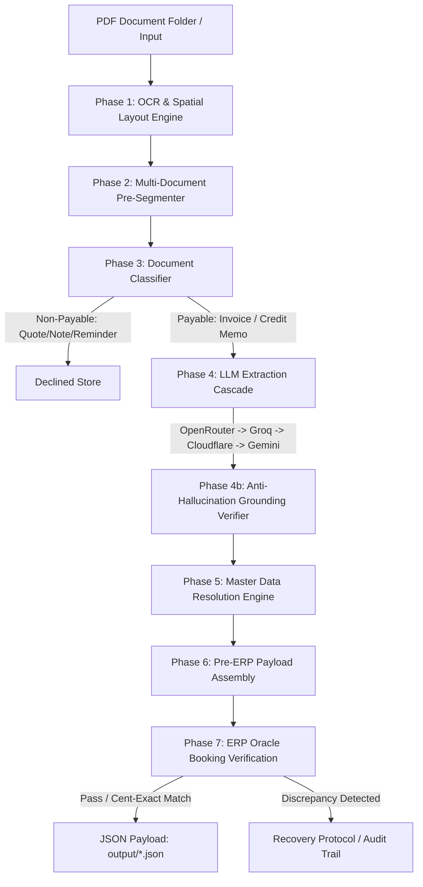

# 🧾 invoice2ERP
### Intelligent Financial Document Ingestion & ERP Booking Engine


**invoice2ERP** is an enterprise-grade financial document processing engine designed to solve the critical gap between **AI document parsing** and **audit-compliant ERP ledger booking**. 

Unlike standard OCR or basic LLM extractors that merely convert images to text, invoice2ERP enforces strict **anti-hallucination grounding rules**, **multi-document segmentation**, **master data resolution**, and a **deterministic ERP booking verification oracle** to guarantee cent-exact accounting accuracy.

---

## 💡 The Problem & The Solution

### The Industry Challenge
In enterprise procurement systems (such as SAP, Oracle, Zycus, or NetSuite), processing incoming supplier invoices and credit notes is a major operational bottleneck:
1. **Extraction $\neq$ Booking**: Extracting text from an invoice is easy. However, an ERP system requires exact itemized decomposition (net unit prices, line vs. header tax placement, withholding taxes, freight levies, discounts). If a single tax rate or line item is misclassified, the ERP recomputation fails.
2. **AI Hallucinations**: Standard LLMs frequently invent missing numbers or alter totals to make equations balance. In financial accounting, an ungrounded number violates audit compliance.
3. **Multi-Document Bundles**: Suppliers often send multi-page PDFs containing mixed content (e.g., delivery notes, quotes, or multiple stapled invoices).

### How invoice2ERP Solves It
* **Multi-Provider LLM Fallback Cascade**: High-availability pipeline routing across OpenRouter, Groq, Cloudflare Workers AI, and Google Gemini.
* **Scale-Invariant 2D Layout OCR**: Preserves spatial table structure across scanned and digital PDFs regardless of page DPI or font scaling.
* **Multi-Document Pre-Segmentation**: Auto-detects sub-document boundaries, page-sequence restarts ("Page 1 of N"), and PO continuity.
* **Token-Level Grounding Engine**: Audits every extracted field against raw layout text; any ungrounded value is safely blanked rather than guessed.
* **Master Data Matcher**: Resolves supplier VAT/name similarity ($\ge 85\%$), chart-of-books buyer codes, tax master codes, and date-delta payment terms against enterprise reference databases.
* **ERP Recomputation Oracle**: Verifies that extracted raw components foot to the document's true gross payable amount before booking.

---

## 🏗️ System Architecture



---

## ✨ Key Features

### 1. Multi-Provider LLM Cascade & Deterministic Fallback
The extraction router ([src/extractor.py](file:///c:/Users/chitr/Desktop/coding/Zycus%20Assignment/candidate_kit/src/extractor.py)) automatically fails over between active providers if rate limits or quota errors occur:
1. **OpenRouter API** (`meta-llama/llama-3.3-70b-instruct`)
2. **Groq API** (`llama-3.3-70b-versatile`)
3. **Cloudflare Workers AI** (`@cf/meta/llama-3.1-8b-instruct`)
4. **Google Gemini API** (`gemini-1.5-flash`)
5. **Deterministic Regex Fallback**: Fully offline extraction fallback if API access is completely unavailable.

### 2. Strict Rule-1 Grounding (Anti-Hallucination)
Every extracted string, date, amount, price, or tax rate undergoes strict verification against the OCR layout text ([src/grounding.py](file:///c:/Users/chitr/Desktop/coding/Zycus%20Assignment/candidate_kit/src/grounding.py)). If an LLM attempts to invent a unit price or quantity to make math balance, the grounding verifier catches and zeroes out the ungrounded field.

### 3. Master Data Resolution Engine
Raw document strings are dynamically matched against enterprise reference tables ([src/master_matcher.py](file:///c:/Users/chitr/Desktop/coding/Zycus%20Assignment/candidate_kit/src/master_matcher.py)):
* **Suppliers** ([master_data/suppliers.json](file:///c:/Users/chitr/Desktop/coding/Zycus%20Assignment/candidate_kit/master_data/suppliers.json)): Matched via exact VAT ID or fuzzy name similarity (`SequenceMatcher` threshold $\ge 0.85$).
* **Buyer Codes** ([master_data/chart_of_books.json](file:///c:/Users/chitr/Desktop/coding/Zycus%20Assignment/candidate_kit/master_data/chart_of_books.json)): Resolved via token-overlap matching against company, business unit, and location addresses.
* **Tax Codes** ([master_data/tax_master.json](file:///c:/Users/chitr/Desktop/coding/Zycus%20Assignment/candidate_kit/master_data/tax_master.json)): Mapped by country code and tax rate.
* **Payment Terms** ([master_data/payment_terms.json](file:///c:/Users/chitr/Desktop/coding/Zycus%20Assignment/candidate_kit/master_data/payment_terms.json)): Matched via text aliases or calculated date differences in days (`due_date - invoice_date`).

### 4. Interactive Developer Control Panel
Includes a full-featured Streamlit UI ([app.py](file:///c:/Users/chitr/Desktop/coding/Zycus%20Assignment/candidate_kit/app.py)) featuring:
* Batch vs. Single Document selection.
* Real-time 7-phase step trace inspector.
* Dual `sys.stdout` log streaming feed.
* Live ERP booking pass/fail metrics.

---

## 🚀 Quick Start

### Prerequisites
* **Python 3.10+**
* Operating System: Windows, macOS, or Linux

### Installation

1. **Clone the repository**:
   ```bash
   git clone https://github.com/your-username/invoice2ERP.git
   cd invoice2ERP
   ```

2. **Create and activate a virtual environment**:
   ```bash
   python -m venv .venv
   # On Windows:
   .venv\Scripts\activate
   # On macOS/Linux:
   source .venv/bin/activate
   ```

3. **Install dependencies**:
   ```bash
   pip install -r requirements.txt
   pip install streamlit python-dotenv easyocr numpy
   ```

4. **Configure Environment Variables**:
   Copy `.env.example` to `.env` and add your preferred LLM API keys:
   ```bash
   cp .env.example .env
   ```

---

## 💻 Usage

### 1. Launch the Streamlit Control Panel (GUI)
Experience live step-by-step pipeline execution and visualization:
```bash
streamlit run app.py
```
Open your browser at `http://localhost:8501`.

### 2. Batch Execution CLI (Full Directory Ingestion)
Process all PDF documents in the `documents/` directory and emit JSON payloads into `output/`:
```bash
python main.py documents/
```

To limit execution to specific documents:
```bash
python main.py documents/ --only INV-01,INV-02
```

### 3. Single Document Inspector CLI
Run a single document through detailed classification, raw LLM extraction, grounding verification, and ERP booking checks:
```bash
python run_single.py INV-01
```

### 4. ERP Oracle Calculator Example
Recompute the booked gross for any autodraft payload:
```bash
python example_check.py sample_autodraft.json
```

---

## 📂 Repository Structure

```
invoice2ERP/
├── app.py                   # Streamlit Developer Control Panel UI
├── main.py                  # Single-command batch pipeline orchestrator
├── run_single.py            # CLI inspector for single-document debugging
├── erp.py                   # ERP oracle booking recomputation engine
├── example_check.py         # Usage example for ERP booking recomputation
├── requirements.txt         # Core Python dependencies
├── .env.example             # Environment configuration template
├── AUTODRAFT_SCHEMA.md      # Output JSON schema specification
├── ARCHITECTURE.md          # Technical design & engineering whitepaper
├── src/
│   ├── classifier.py        # Phase 3: Document classification engine
│   ├── extractor.py         # Phase 4: Structured LLM extraction cascade & fallbacks
│   ├── grounding.py         # Phase 4b: Rule-1 anti-hallucination verifier
│   ├── master_matcher.py    # Phase 5: Master data resolution engine
│   ├── ocr_engine.py        # Phase 1: PDF rendering & 2D spatial layout OCR
│   └── segmenter.py         # Phase 2: Multi-document PDF pre-segmenter
├── documents/               # Input sample PDF documents
├── master_data/             # Master reference datasets (JSON)
├── parsed_files/            # Cached 2D spatial layout text files
└── output/                  # Generated JSON autodraft payloads
```

---

## 📊 Output Contract (`output/*.json`)

For each processed document `X.pdf`, invoice2ERP outputs a structured payload `output/X.json`:

```json
{
  "file": "INV-01.pdf",
  "payables": [
    {
      "invoice_number": "INV-9821",
      "invoice_date": "2024-01-15",
      "due_date": "2024-02-14",
      "invoice_type": "INVOICE",
      "currency": "EUR",
      "gross_total": "1450.00",
      "subtotal": "1200.00",
      "total_tax_amount": "250.00",
      "supplier": {
        "name": "Acme Industrial Supplies GmbH",
        "supplier_id": "SUP-8821",
        "vat_id": "DE812345678"
      },
      "buyer": {
        "company_code": "BOLTGROUP",
        "business_unit_code": "BU-DE-01",
        "location_code": "LOC-BERLIN"
      },
      "line_items": [
        {
          "description": "Industrial Gear Unit",
          "quantity": "2.00",
          "unit_price": "600.00",
          "total": "1200.00",
          "tax_rate": "20.00",
          "tax_amount": "240.00"
        }
      ]
    }
  ],
  "declined": []
}
```

---

## 🛡️ License

Distributed under the MIT License. See `LICENSE` for more information.
